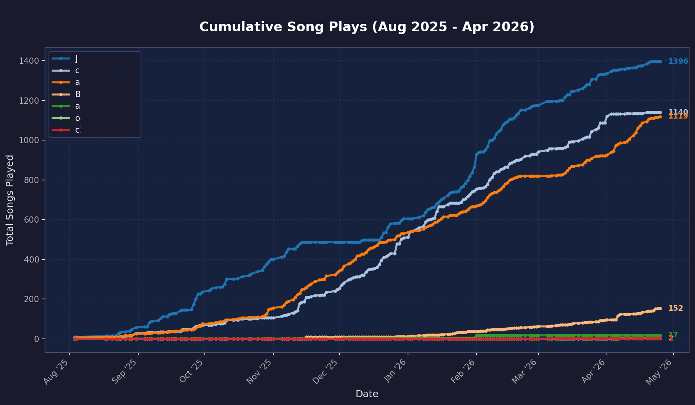

# Discord Music Bot

A personal Discord music bot built with `discord.py`, `yt-dlp`, FFmpeg, and SQLite. It primarily plays music from YouTube search results or direct YouTube links, with SoundCloud URLs also supported through `yt-dlp`.

I built this for my own Discord server, and I am open sourcing it mainly as a professional portfolio example rather than as a polished public product. It is shared as-is, and I do not expect to maintain it like a general-purpose bot for other communities.

## What It Does

*   Plays YouTube audio from search terms, selected search results, or direct URLs.
*   Supports SoundCloud URLs through the same `yt-dlp` backend.
*   Caches downloaded songs locally by default so repeated plays can start faster and avoid duplicate downloads.
*   Can run in a no-cache-download mode that reuses existing cached songs and streams uncached songs.
*   Tracks every song request in a local SQLite database, including the requester, server, resolved title, URL, duration, and play status.
*   Uses that play history for stats commands, leaderboards, an animated leaderboard race, and cumulative play graphs.
*   Provides a small local web interface for live logs, restart, and shutdown.
*   Automatically disconnects from empty or inactive voice channels.
*   Streams very long songs instead of downloading them, keeping cache size reasonable.

## Stats And Play History

Every song request is saved to an SQLite database. This history makes it possible to see who requests the most songs, how activity changes over time, and how the server leaderboard evolves.

The `!cg` command generates a cumulative song-play graph from the database:



The same database format is also designed to work with my related Last.fm automation project, [last-fm-auto](https://github.com/jackmanuel/last-fm-auto), which I intend to open source as well. That project uses the bot's play history as a source for automatic Last.fm scrobbling.

## Commands

The most commonly used commands are:

*   `!play <song name or URL>`: Searches YouTube or plays a YouTube/SoundCloud URL.
*   `!search <song name>`: Shows selectable YouTube results.
*   `!queue` or `!q`: Shows the current queue.
*   `!skip`: Skips the current song.
*   `!stats [@user]`: Shows request stats.
*   `!leaderboard` or `!lb`: Shows the top requesters.
*   `!cg`: Generates a cumulative play graph.
*   `!leaderboardrace`: Generates an animated leaderboard race video.

See [docs/COMMANDS.md](docs/COMMANDS.md) for the full command reference.

## Setup For Windows

### Prerequisites

*   Python 3.10 or newer.
*   FFmpeg available on your system `PATH`.
*   A Discord bot token from the [Discord Developer Portal](https://discord.com/developers/applications).

### Installation

Clone or download the repository, then run:

```powershell
python -m venv .venv
.\.venv\Scripts\activate
pip install -r requirements.txt
```

Copy `.env.example` to `.env`, then set your Discord bot token:

```dotenv
DISCORD_BOT_TOKEN=YOUR_BOT_TOKEN_HERE
```

Optional settings, including a custom FFmpeg path and maximum cache download duration, are documented in `.env.example`.

### Running The Bot

Run `start_bot.bat` to start the bot. The startup window closes after launch; ongoing monitoring and management happen through the local web interface.

To avoid creating new cached song files, run `start_bot_no_cache.bat` instead. In this mode, the bot still uses songs already present in `song_cache/`, but streams anything that is not already cached. The same mode can also be enabled with `--no-cache` or `DISABLE_SONG_CACHE=true`.

Open `http://localhost:8000` to view live logs, restart the bot, or shut it down. You can also run `stop_bot.bat` to send the same graceful shutdown request.

## Project Structure

*   `src/music_bot/`: Bot source code and supporting Python modules.
*   `web/templates/`: HTML template for the local log viewer.
*   `tests/`: Unit tests for the YouTube query helpers.
*   `database/`, `logs/`, and `song_cache/`: Runtime data generated by the bot.
